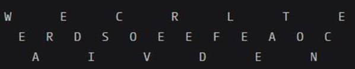
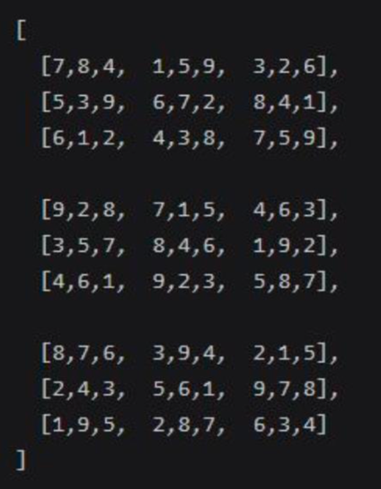
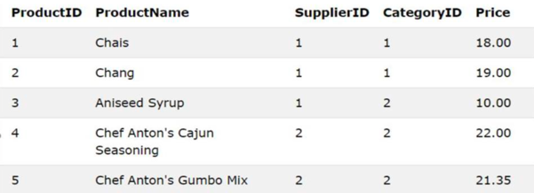
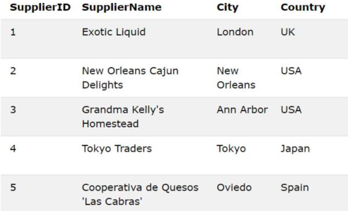
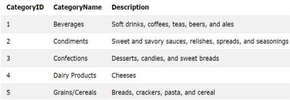

# Task solutions

### ⚡️ TASK 1. Rail Fence Cipher. Encoding and Decoding
Create two functions to encode and then decode a string using the Rail Fence Cipher. This cipher is used to encode a string by placing each character successively in a diagonal along a set of "rails". First start off moving diagonally and down. When you reach the bottom, reverse direction and move diagonally and up until you reach the top rail. Continue until you reach the end of the string. Each "rail" is then read left to right to derive the encoded string.

For example, the string "WEAREDISCOVEREDFLEEATONCE" could be represented in a three-rail system as follows:

The encoded string would be: WECRLTEERDSOEEFEAOCAIVDEN
1. Write a function/method that takes 2 arguments, a string and the number of rails, and returns the ENCODED string.
2. Write a second function/method that takes 2 arguments, an encoded string and the number of rails, and returns the DECODED string.
   For both encoding and decoding, assume number of rails >= 2 and that passing an empty string will return an empty string.

### 💡 TASK 2: Print a new number by adding one to each of its digit
A number is input in computer then a new no should get printed by adding one to each of its digit. If you encounter a 9, insert a 10.
transform(998) -> 10109.

Note: do not transform incoming number into string.

### 📖️ TASK 3. Validate Sudoku with size `NxN`
Given a Sudoku data structure with size NxN, N > 1 and √N == integer, write a method to validate if it has been filled out correctly.
The data structure is a multidimensional Array (List<List<Integer>>), i.e. for example Sudoku with size 9x9:

Rules for validation:
* Data structure dimension: NxN where N > 1 and √N == integer.
* ‘Small squares’ (3x3 in example above) should be √Nx√N.
* A number in multidimensional array may only appear once in a single row, column or in the ‘Small square‘.

### 🎯 TASK 4. Sortable Shapes
Although shapes can be very different by nature, they can be sorted by the size of their area.

Create 4 different shapes (Square, Rectangle, Triangle, Circle) that can be part of a sortable list. The sort order is based on the size of their respective areas:
* The area of a Square is the square of its side
* The area of a Rectangle is width multiplied by height
* The area of a Triangle is base multiplied by height divided by 2
* The area of a Circle is the square of its radius multiplied by π

The default sort order of a list of shapes is ascending on area size: 

Example:
 int side = 3;
 int radius = 1;
 int base = 5;
 int height = 2;
 List<Shape> shapes = new ArrayList<>(); 
 shapes.add(new Square(side));
 shapes.add(new Circle(radius));
 shapes.add(new Triangle(base, height));

As a result, your shapes should be sorted correctly ascending on area size. 

Note: Use the correct π constant for your circle area calculations: Math.PI

### 🤖 TASK 5.
Create database ‘MyShop’ with 3 tables: ‘Products’, ‘Categories’(will include info about categories of Products) and ‘Suppliers’ and populate them with data from images below.

Products table:

Suppliers table:

Categories table:

Create the next queries:
* Select product with product name that begins with ‘C’.
* Select product with the smallest price.
* Select cost of all products from the USA.
* Select suppliers that supply Condiments.
* Add to database new supplier with name: ‘Norske Meierier’, city: ‘Lviv’, country: ‘Ukraine’ which will supply new product with name: ‘Green tea’, price: 10, and related to category with name: ‘Beverages’.

Data for Database

Products table:
 1; Chais; 1; 1; 18.00
 2; Chang; 1; 1; 19.00
 3; Aniseed Syrup; 1; 2; 10.00
 4; Chef Anton’s Cajun Seasoning; 2; 2; 22.00
 5; Chef Anton’s Gumbo Mix; 2; 2; 21.35 

Suppliers table:
 1; Exotic Liquid; London; UK
 2; New Orleans Cajun Delights; New Orleans; USA
 3; Grandma Kelly’s Homestead; Ann Arbor; USA
 4; Tokyo Traders; Tokyo; Japan
 5; Cooperativa de Quesos ‘Las Cabras’; Oviedo; Spain

Categories table:
 1; Beverages; Soft drinks, coffees, teas, beers, and ales
 2; Condiments; Sweet and savory sauces, relishes, spreads, and seasonings
 3; Confections; Desserts, candies, and sweet breads
 4; Dairy Products; Cheeses
 5; Grains/Cereals; Breads, crackers, pasta, and cereal

### 🔥 Getting Started
To get started follow these steps:
1. Clone the repository: git clone https://github.com/khrystyna-dev/task-solutions.git
2. For tasks from 1 to 4 just run Main class
3. For task 5 - set up the MySQL database.
4. Also configure field values to your specific properties in [hibernate.cfg.xml](src/main/resources/hibernate.cfg.xml) in the project. It should contain the database connection settings. Fill in the appropriate values.
5. Run the application.

